# Lesson: Interaction Design

### First and Last Name: Efstratios Koutoulakis | Michail - Angelos Sotirchos | Andreas Birbilis 
### University Registration Number: dpsd19061 | dpsd19125 | dpsd19080
### GitHub Personal Profile: xxx

# Introduction

# Summary

# 1st Deliverable
## I. DESIGN BRIEF

Σκοπός του πρότζεκτ μας είναι να διαμορφώσουμε ένα κατάλληλο διαδραστικό σύστημα προσομοίωσης ενός αυτοκινήτου (tangible kids' toy) το οποίο θα έχει εκπαιδευτικούς σκοπούς. Ο χρήστης θα έχει την δυνατότητα να αποσυναρμολογεί και να επανασυνδέει το υλικό σύστημα (αυτοκινητάκι). Η συναρμολόγηση και η σύνδεση θα είναι intuitive και εύκολη επιτρέποντας κατάλληλη διαμόρφωση διαφορετικών διατάξεων κινητήριων τροχών (RWD, FWD, 4x4, AWD). Μέσω πειραματισμού, ο χρήστης θα αντιλαμβάνεται πώς επηρεάζουν την συμπεριφορά του αυτοκινήτου οι μηχανισμοί αυτοί ενώ ο έλεγχος του υλικού συστήματος θα πραγματοποιείται μέσω εφαρμογής κινητού.

## II. PACT

### PEOPLE

Το target group για το οποίο επιθυμούμε να σχεδιάσουμε αφορά μαθητές (13-17) οι οποίοι έχουν μία επαφή με την τεχνολογία των αυτοκινήτων αλλά επιδιώκουν να επαυξήσουν την κατανόησή τους για το πως λειτουργούν οι τύποι διαφορικών συστημάτων του αυτοκινήτου. Τα άτομα αυτά κατέχουν βασικές/απλές γνώσεις για το πώς είναι διαμορφωμένο ένα σασί (με κάποια βασικά εξαρτήματα όπως το διαφορικό, που συνδέει τον κινητήρα με τις ροδες, τις μπροστά ή τις πίσω ή όλες και τη συμπεριφορά του αυτοκινήτου αναλόγα με την τοποθέτηση των κινητήριων τροχών) και είναι σε θέση να χρησιμοποιήσουν αυτό το νοητικό μοντέλο για να προσθέσουν νέους ορισμούς και μηχανισμούς οι οποίοι θα εμπλουτίσουν την κατανόησή τους για την συμπεριφορά του αυτοκινήτου κατά την κίνηση. Λαμβάνουμε ως δεδομένο ότι η ομάδα αυτή ανθρώπων εμφανίζουν σχετική ευχέρεια στην χρήση κινητών συσκευών και είναι σε θέση να από- και συναρμολογήσουν ένα απλό σύστημα (αυτοκινητάκι) για να αντλήσουν στοιχεία για την λειτουργία ενός μηχανισμού μέσω της αλληλεπίδρασής τους με αυτόν. Η αλληλεπίδραση των μαθητών με την διεπαφή θα πραγματοποιείτε είτε στα Ελληνικά είτε στα Αγγλικά.

### ACTIVITIES
**Goals, Tasks and Actions**

--> Οπως προαναφέρθηκε ο βασικός στόχος είναι ο πειραματισμός μεταξύ διαφορετικών layout μετάδοσης κίνησης (RWD, FWD, AWD, 4WD) του αυτοκινήτου και πώς μεταβάλλεται η συμπεριφορά του αναλόγως με τους κινητήριους τροχούς. Οι διεργασίες που πρέπει να γίνουν είναι απλές. Σε πρώτη φάση ο χρήστης τοποθετεί πάνω στο βασικό σκελετό, του μπροστινούς και πίσω τροχούς, το ποιοι θα είναι οι κινητήριοι αφορά την δική του προτίμηση και σε δεύτερη φάση να συνδέσει την εφαρμογή από το κινητό του με το αυτοκίνητο ετσι ώστε να μπορεί να το ελέγχει.

**Regular or Unusual Tasks?**

--> Οι διεργασίες που θα πρέπει να κάνει για να επιτευχθεί ο στόχος, θα είναι εύκολες, ακόμη κι αν περάσει αρκετός χρόνος χωρίς το αντικείμενο να χρησιμοποιείται, όταν χρησιμοποιηθεί ξανά, ο χρήστης θα θυμάται τι ακριβώς πρέπει να κάνει εφόσον αφορά την απλή σύνδεση υλικών κομματιών.

**Complexity**

--> Οι συνδέσεις μεταξύ του σασί του αυτοκινήτου και των ροδών θα είναι ξεκάθαρες και άμεσες οπότε η περιπλοκότητα θα είναι μικρή.

**Cooperative features**

--> Ο χρήστης δεν χρειάζεται κάποιο άλλο άτομο για να επιτεύξει τον στόχο του, όμως η συνεργασία δύο ή παραπάνω ατόμων επηρεάζει τις διεργασίες θετικά ως προς την άποψη του χρόνου.

**Temporal Aspects**

*Ο χρήστης θα χρησιμοποιεί το αντικείμενο στον ελεύθερό του χρόνο οπότε αναμένεται να χρησιμοποιείται κατά μέσο όρο στις 3 φορές την εβδομάδα , ενώ η διάρκεια χρήσης περιορίζεται στα 20 λεπτά λόγω της μπαταρίας. Επιπλέον, εξαιτίας του εκπαιδευτικού χαρακτήρα του αντικειμένου ο χρήστης θα σταματά τη διαδικασία έτσι ώστε να αλλάξει την διάταξη των κινητήριων τροχών ή μη κινητήριων και να δοκιμάσει τη συμπεριφορά του συνεχίζοντας τη διαδικασία ψυχαγωγίας. Ο χρόνος απόκρισης του αντικειμένου θα είνα σύντομος επειδή το μονο που χρειάζεται να κάνει ο χρήστης ειναι να συνδέσει το κινητό του τηλέφωνο με αυτό και να συναρμολογήσει τα τρία κομμάτια από τα οποία θα αποτελείται.*

--> Συχνότητα: ~3 Φορές την εβδομάδα.

--> Διάρκεια: 20 λεπτά.

--> Συνέχεια: Διακοπτόμενο

--> Χρόνος ανταπόκρισης: Μικρός

**Multi-tasking vs Serial Tasks - Passive vs Active**

--> Οι διεργασίες θα είναι σειριακές, ο χρήστης δεν θα χρειαστεί να έχει το νου του σε δύο ή παραπάνω πράγματα αλλά θα πρέπει να θυμάται με ποιά σειρά γίνονται, πράγμα που δεν θα είναι δύσκολο λόγω μικρής περιπλοκότητας. Η διαδικασία δεν θα είνα παθητική αλλά πιο ενεργητική εφόσον αφορά τον real-time έλεγχο ενος αυτοκινήτου.

**Safety Critical**

--> Εφόσον η περιπλοκότητα θα είναι μικρή, θα υπάρχει μικρή πιθανότητα σφάλματος. Αν συμβεί κάποιο σφάλμα δεν θα τοποθετήσει σε κίνδυνο ανθρώπινες ζωές.

### CONTEXT
**Physical Context**

--> Το αντικείμενο θα χρησιμοποιείται κυρίως σε μεγάλους εξωτερικούς επίπεδους χώρους. Οι συνθήκες θα πρέπει να έιναι ήπιες, ηλιόλουστες ήμέρες χωρίς υγρασία στο έδαφος και σε περίπτωση κακοκαιρίας ο χρήστης μπορεί να το αποθηκεύσει σε εσωτερικό χώρο. Επιπλέον αν ο εσωτερικός χώρος είναι επίσης αρκετά μεγάλου μεγέθους χωρίς πολλά εμπόδια η χρήση του αντικειμένου είναι επίσης αποδεκτή.

**Social Context**

--> Οσον αφορά το κοινωνικό πλαίσιο, η μόνη ενημέρωση του χρήστη για το πως λειτουργεί το αντικείμενο έιναι η εφαρμογή στο κινητό του. Συνδέεται με το αντικείμενο προκειμένου να ελεγχθεί, αλλά θα περιέχει εκπαιδευτικό σχετικά με τα διαφορετικά layout μετάδοσης κίνησης.

### TECHNOLOGIES

**Input**

--> Η είσοδος του χρήστη στο αντικείμενο θα είναι κυρίως το ψηφιακό χειριστήριο της εφαρμογής που αφορά τον έλεγχό του.

**Output**

--> Όσον αφορά την έξοδο του αντικειμένου, θα είναι η κίνηση του αυτοκινήτου που παράγεται απο τα ηλεκτρικά μοτέρ (actuators).

**Communication**

--> Θα υπάρχει επικοινωνία του αυτοκινήτου με το κινητό τηλέφωνο του χρήστη και η σύνδεση θα γίνεται μέσω bluetooth.

# 2nd Deliverable

## III. INFORMATION ARCHITECTURE

Στο παρόν κείμενο γίνεται η παρουσίαση και η ανάλυση της βασικής αρχιτεκτονικής της πληροφορίας του project. Οι πληροφορίες είναι ιεραρχημένες (από πάνω προς τα κάτω) χρονικά και με κόκκινο τονίζονται ορισμένες δομές στην ιεραρχία οι οποίες κατεχουν σημαντικό λειτουργικό ρόλο για την εφαρμογή αλλά και ολόκληρο το σύστημα.
 
Η αρχιτεκτονική της πληροφορίας του συστήματος είναι σπασμένη σε τρία βασικά "branch", στην σύνδεση και στον έλεγχο, στην ενημέρωση, και στην "εκπαίδευση". Η σημαντικότερη λειτουργία που πραγματοποιείται από το σύστημα είναι η σύνδεση με το αυτοκίνητο μέσω bluetooth και στη συνέχεια ο έλεγχος αυτού. Στο ενδιάμεσο ο χρήστης θα έχει την δυνατότητα να αλλάξει την διαρρύθμιση των κινητήριων τροχών με σκοπό να μάθει πώς η κάθε επιλογή επηρεάζει την συμπεριφορά του αυτοκινήτου, μέσω άμεσης παρατήρησης και ελέγχου του υλικού συστήματος. Είναι κρίσιμο να τονίσουμε πως στην φάση που ο χρήστης θα πραγματοποιεί αλλαγές στο υλικό σύστημα, η εφαρμογή θα πρέπει να τον καθοδηγεί με σωστές και καλά παρουσιάσιμες οδηγίες. Όταν η αλλαγή στους κινητήριους τροχούς έχει ολοκληρωθεί, ο χρήστης manually θα δίνει το "οκ" για να συνεχίσει στον έλεγχο του αυτοκινήτου.
 
Εκτός του βασικού αυτού branch, εμφανίζονται και άλλα δύο τα οποια κατέχουν δευτερεύουσα λειτουργία, η εκπαίδευση και η ενημέρωση. Με την επιλογή της εκπαίδευσης, η εφαρμογή θα παρουσιάζει στον χρήστη κάποιες αρχικές πληροφορίες για του ορισμούς που θα δει κατά την χρήση του όλου συστήματος (RWD, FWD, 4x4, AWD) και στην συνέχεια θα του παρουσιάζει ορισμένα links για να αναζητήσει με ευκολία πιο αναλυτικές πληροφορίες. Επίσης, υπάρχει και το Βranch της ενημέρωσης (about). Η λειτουργία που καλύπτεται από τον κλάδο αυτό είναι η αναφορά και σημείωση των μελών της ομάδας όπως επίσης και κάποια βασικά στοιχεία για την σχολή, το μάθημα, και το project.

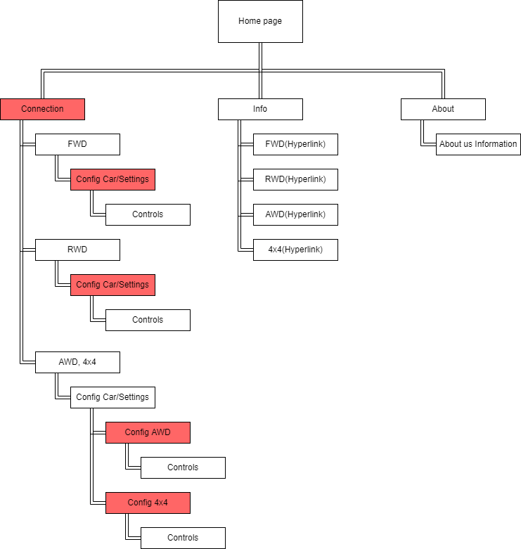

## IV. USER INTERACTION

Στο παρόν κείμενο γίνεται βαθύτερη ανάλυση των διαφόρων πλάνων δράσεων του χρήστη βάσει της αρχιτεκτονικής που έχουμε σχεδιάσει προηγουμένως. Όπως έγινε φανερό στην IA μας, ο χρήστης θα έχει τρεις βασικές πτυχές προς τις οποίες θα μπορεί να κινηθεί: 1) Σύνδεση και έλεγχος, 2) εκπαίδευση, και 3) ενημέρωση. Θα πάρουμε αναλυτικά τον κάθε κλάδο και θα παρουσιάσουμε πως σε κάθε στάδιο σχεδιάζουμε να αλληλεπιδράσει ο χρήστης και με το φυσικό αλλά και με το ψηφιακό σύστημα (την εφαρμογή).
 
### 1.	Σύνδεση και έλεγχος

Μόλις έχει το αυτοκινητάκι μπροστά του ο χρήστης και την εφαρμογή κατεβασμένη στο κινητό του, είναι έτοιμος να αρχίσει. Πατώντας την επιλογή για σύνδεση με το αυτοκίνητο, θα συνδέεται με το υλικό σύστημα. Αμέσως μετά, η εφαρμογή θα του δίνει τις τρεις επιλογές διαρρύθμισης μετάδοσης κίνησης (RWD, FWD, AWD) και θα του ζητάει να επιλέξει μία από αυτές προτού του δοθεί ο έλεγχος του αυτοκινήτου. Η κάθε επιλογή ακολουθεί την δική της υποκατεύθυνση αναλόγως:

   - **RWD και FWD:** (Οι δύο αυτές υποκατευνύνσεις λαμβάνονται ως μία γιατί διαφέρουν ελάχιστα στο γενικό βαθμό)
Όταν ο χρήστης επιλέξει μία από τις δύο αυτές επιλογές, η εφαρμογή δεν θα του δίνει ακόμα τον έλεγχο του αυτοκινήτου. Ο χρήστης θα πρέπει να σιγουρευτεί πως η διαρρύθμιση των κινητήριων τροχών είναι σωστή. Για τον σκοπό αυτό, σε αυτό το στάδιο θα εμφανίζονται εύκολες και γρήγορες οδηγίες για το πως θα πρέπει να είναι το αυτοκίνητο, τι συμπεριφορά θα αναμένει από το αυτοκίνητο με την επιλεγμένη διαρρύθμιση, και τι πρέπει να κάνει για να επιτύχει την διαρύθμιση αυτή (θα δείχνονται απλά μοντέλα του αυτοκινήτου, gifs για καλύτερη ανάδραση των οδηγιών, και λίγο κείμενο αν χρειαστεί). Μόλις ο χρήστης είναι σίγουρος ότι η διαρρύθμισή του είναι σωστή και αντιστοιχεί στην επιλογή του, θα πατάει "οκ" και θα συνεχίζει. Τέλος, εφόσον έχουν ολοκληρωθεί τα προηγούμενα βήματα, θα έχει πλέoν τον έλεγχο του αυτοκινήτου μέσω της εφαρμογής (η εφαρμογή θα του εμφανίζει ένα απλό ψηφιακό χειριστήριο).

   - **AWD και 4x4:** Το πλάνο δράσης για την κατηγορία αυτή ακολουθεί το ίδιο μοντέλο με το από πάνω. Η μόνη διαφορά θα είναι στο κομμάτι των οδηγιών και του configuration. Η επιλογή για ADW θα απαιτεί από τον χρήστη προτού πάρει τον έλεγχο να προσδιορίσει επίσης το ποσοστό κίνησης των τροχών. Μόλις ρυθμιστεί όπως θέλει ο χρήστης αυτό το στοιχείο, είναι έτοιμος να πάρει το χειριστήριο στην εφαρμογή και να τρέξει το αυτοκινητάκι.

### 2.	Εκπαίδευση

Ο χρήστης πριν συνδεθεί έχει την επιλογή να διαβάσει και να μάθει περισσότερα για τους μηχανισμούς και τις διαρρυθμίσεις που παρουσιάζονται κατά την χρήση του συστήματος. Πατώντας της επιλογή αυτή, θα οδηγείται σε ένα παράθυρο που θα του εμφανίζει links για να διαβάσει και να εμπλουτίσει την κατανόησή του για τα RWD, FWD, AWD, 4x4.

### 3.	About

Μέσω της επιλογής αυτής, ο χρήστης θα οδηγείται σε ένα παράθυρο το οποιο θα παρουσιάζει τους δημιουργούς του project, τον επιβλέπον της εργασίας, το μάθημα στο οποίο το όλο σύστημα αποτελεί εργαστηριακή εργασία, και θα δίνει σύνδεσμο την ιστοσελίδα του τμήματος. 

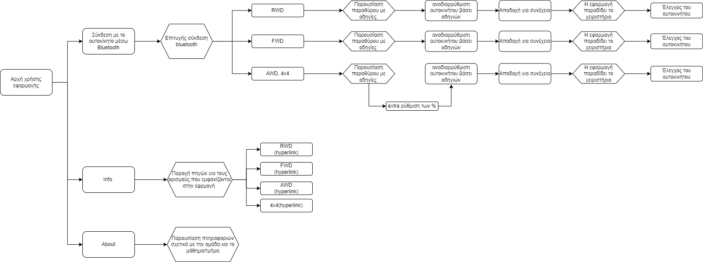

## V. INTERFACE DESIGN

### Τηλεκατευθυνόμενο Αυτοκίνητο

--> Το interface που αφορά το αυτοκίνητο είναι απλό. Προκειμένου ο χρήστης να στήσει το σύστημα μετάδοσης κίνησης που επιθυμεί, τοποθετεί ανάλογα τις κινητήριες και μη κινητήρες μονάδες τροχών πάνω στο κεντρικό σώμα.

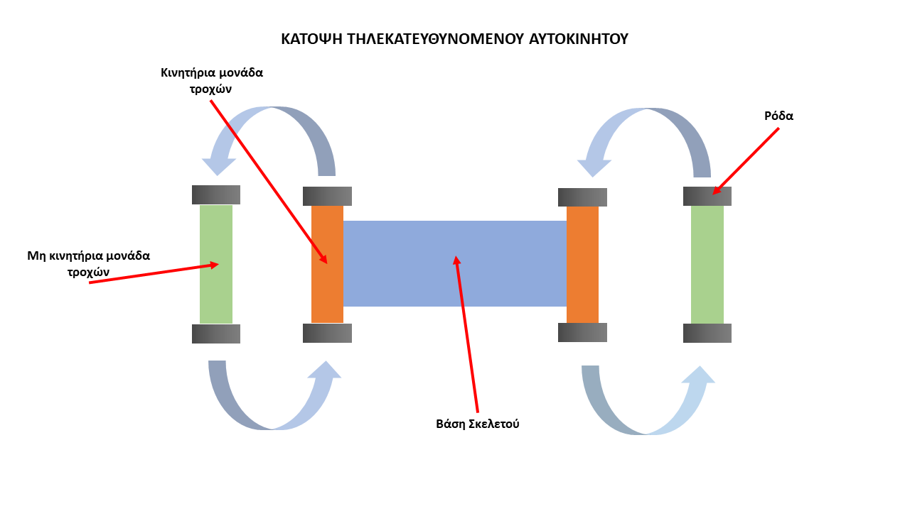

### Εφαρμογή Κινητού

(Να σημειωθεί οτι αυτή η έκδοση της εφαρμογής βρίσκεται σε πρώιμο στάδιο και κάποιες φωτογραφίες και κείμενα είναι ενδεικτικά.)

--> Ο χρήστης μπορεί να συνδέσει με Bluetooth το αυτοκίνητο με την εφαρμογή και να επιλέξει το σύστημα μετάδοσης που θέλει να δοκιμάσει. Οταν επιλέξει, του εμφανίζεται μια ενημερωτική οθόνη για το πώς να διαρυθμίσει το αυτοκίνητο και μετά από αυτό, εμφανίζονται τα χειριστήρια για τον έλεγχο. Επιπλέον, από την αρχική οθόνη ο χρήστης έχει πρόσβαση σε εκπαιδευτικό υλικό σχετικά με τα συστήματα μετάδοσης κίνησης και μπορεί να δεί πληροφορίες σχετικά με τους δημιουργούς του Project.

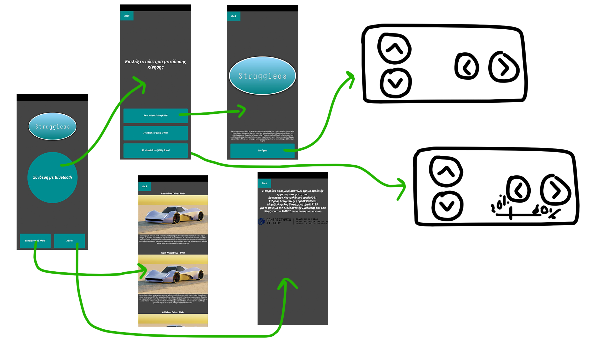

# 3rd Deliverable 

## VI. SCENARIOS AND STORYBOARDING

## VII. PROTOTYPING

### Μικρή Εισαγωγή

--> Στο 3ο παραδοτέο πραγματοποιείται η κατάλληλη διαμόρφωση του κυκλώματος του arduino, η ανάπτυξη του κώδικα, η μοντελοποίηση των βασικών επί μέρους στοιχείων του υλικού συστήματος, η σχεδίαση του εξωτερικού κελύφους του αυτοκινήτου, δημιουργία της εφαρμογής.

**Επιπλέον παρατίθεται το βίντεο παρουσίσασης του πρωτοτύπου**

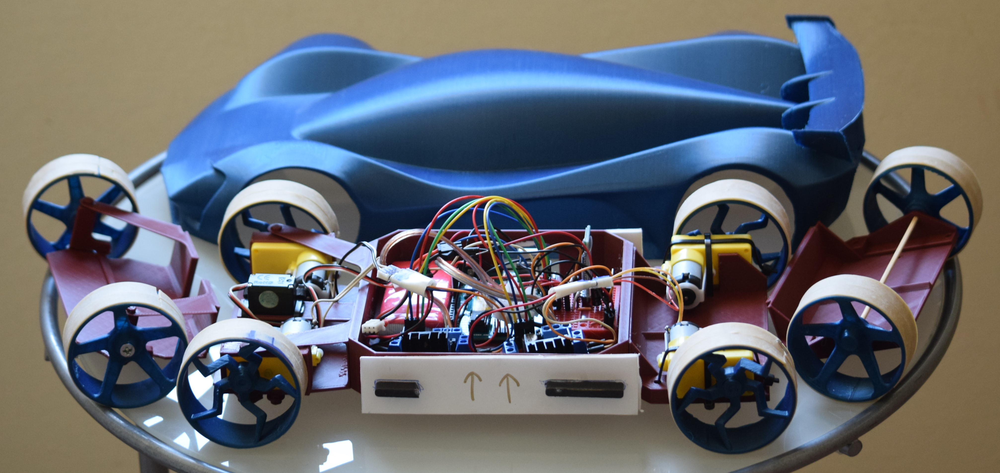

### Περιγραφή Του Κυκλώματος

--> Το κύκλωμα περιέχει συνολικά τέσσερα DC motors συνδεδεμένα με δύο Motor Drivers για την κίνηση, ένα Servo μοτέρ για το στρίψιμο, ένα Arduino Uno, μια μπαταρία, ένα Bluetooth module και ένα Voltage regulator.

--> Η μπαταρία είναι 7.7V και δίνει ρεύμα σε όλο το κύκλωμα, όμως το arduino και το Bluetooth module πρέπει να παίρνουν μόνο 5V οπότε για αυτό τοποθετήθηκε το Voltage Regulator έτσι ώστε καθώς περνάει το ρεύμα από μέσα του, το Voltage Regulator βγάζει αυστυρά 5V. Επιπλέον, προκειμένου η τάση του ρεύματος να είναι σταθερή και όχι θορυβώδες έχουν τοποθετηθεί δύο πυκνωτές ετσι ώστε όταν η τάση είναι παραπάνω από όσο πρέπει οι πυκνωτές την απορροφούν και όταν υπάρχει έλλειψη της τάσης αποφορτίζονται και δίνουν το απόθεμα που έχουν. Τα Motor Drivers έχουν τοποθετηθεί χωρίς το Voltage Regulator διότι σύμφωνα με τα datasheet τους έχουν ήδη ενσωματωμένο Voltage Regulator.

--> Ολα τα εξαρτήματα και καλώδια έχουν τοποθετηθεί με βάση τα datasheet τους.

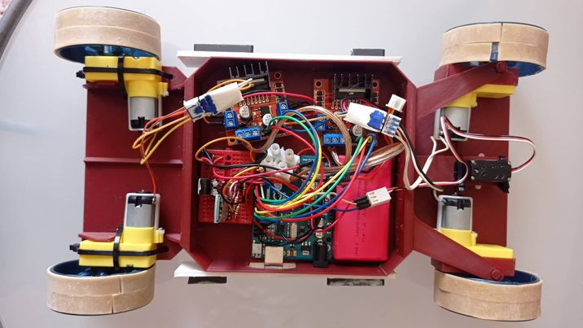

### Περιγραφή Του Κώδικα

--> Στο παρόν απόσπασμα γίνεται ανάλυση της δομής του κώδικα και την λογικής του.
Αρχικά, είναι υποχρεωτικό να αναφερθεί το γεγονός ότι ο κώδικας για το arduino έχει αναπτυχθεί
παράλληλα με τον κώδικα της εφαρμογής. Το χαρακτηριστικό αυτό είναι υψηλής σημασίας
καθώς το μεγαλύτερο τμήμα του προγραμματισμού πραγματοποιήθηκε με γνώμονα το input
που δίνει ο χρήστης από την εφαρμογή για remote bluetooth control.

--> Για την χρήση servo και bluetooth συμπεριλαμβάνονται οι βιβλιοθήκες Servo.h και
SoftwareSerial.h

--> Η λογική και η δομή του κώδικα πάει ακολούθως:
Το πρόγραμμα αποθηκεύει το input του χρήστη από το bluetooth (readString) και στη συνέχεια
αν αυτό είναι "FWD", "RWD" ή "AWD, κατοχυρώνει σε μία ξεχωριστή μεταβλητή temp τον έναν
ξεχωριστό αριθμό που αντιστοιχεί σε κάθε μία από τις τρεις περιπτώσεις. Έπειτα, βάσει της
τιμής temp (αναλόγως της τιμής που έχει λάβει από τον προηγούμενο έλεγχο) το πρόγραμμα
καθορίζει ποια θα είναι η κατάλληλη συνάρτηση που θα χρησιμοποιηθεί.

--> Οι συναρτήσεις ελέγχου είναι τρεις, μία για κάθε τύπο: FWD(), RWD(), ΑWD().
Και οι τρεις συναρτήσεις ακολουθούν μία τυπική δομή. Όταν πατηθεί το κουμπί "Forward" (από
την εφαρμογή) και ο κώδικας πάρει το input "Forward" τότε ενεργοποιούνται τα δύο (μπροστά
για FWD, πίσω για RWD, και τα τέσσερα για AWD) μοτέρ και το αυτοκίνητο κινείται αναλόγως
(Forward/Reverse). Στην περίπτωση που έχουμε στροφή (όπως π.χ. "ReverseRight")
ενσωματώνουμε κώδικα ο οποίος αλλάζει προοδευτικά την στροφή του servo και εκ του
αποτελέσματος των τροχών για να επιτρέψει στο σύστημα να αλλάξει κατεύθυνση. Τέλος,
συγκεκριμένα για την περίπτωση του Forward/Reverse, το πρόγραμμα γυρνάει στο default την
γωνία του servo (servo_steer.write(change_ang)).

--> Δεδομένου ότι και οι τρεις συναρτήσεις ακολουθούν το ίδιο μοτίβο, είναι απαραίτητο να
σημειώσουμε πως η συνάρτηση AWD() παρουσιάζει μία ιδιαιτερότητα. Συγκεκριμένα, με την
επιλογή AWD από την εφαρμογή, ο χρήστης θα επιλέγει και ένα ποσοστό το οποίο
αντιπροσωπεύει την κίνηση των μπροστά και πίσω κινητήριων τροχών. Για την επίτευξη αυτού
του σκοπού προσθέτουμε μία δεύτερη μεταβλητή ελέγχου, την tempAWD, η οποία σηματοδοτεί
ποιο ποσοστό είναι επιλεγμένο. Ακολούθως, βάσει της tempAWD το πρόγραμμα υπολογίζει και
ορίζει σε δύο int μεταβλητές pf (percentageFront), pR (και αντιστοίχως, percentageRear) τα
ποσοστά κίνησης για τα μοτέρ. Τέλος, με την κατάλληλη διαμόρφωση των pF, pR, οι εντολές
analogueWrite() λαμβάνουν τα ποσοστά που έχουν υπολογιστεί για την κίνηση (π.χ.
analogueWrite(fr_pwm,pF)).

**Επιπλέον, σε αυτό το repository εχει αναρτηθεί όλος ο κώδικας στο αρχείο straggleas_code.rar**

### Περιγραφή Tης Εφαρμογής: Straggleas Controller

--> Κατά το άνοιγμα της εφαρμογής, η πρώτη σελίδα της εφαρμογής που αντικρίζει ο χρήστης είναι το βασικό "hub" από το οποίο έχει πρόσβαση στις τρεις βασικές υποκατευθύνσεις (σύνδεση bluetooth και έλεγχος αυτοκινήτου, εκπαιδευτικό υλικό, about). 

**Σύνδεση bluetooth και έλεγχος αυτοκινήτου**

--> Με το πάτημα του μεγάλου κουμπιού στο hub το οποίο αναφέρει "σύνδεση με Bluetooth", στο τηλέφωνο του χρήστη θα εμφανιστεί μία μαύρη οθόνη με πιθανές συσκευές για να κάνει pair (ο χρήστης πρέπει να έχει ανοιχτό το bluetooth). 

--> Με την επιτυχή σύνδεση, θα εμφανίζονται σε άλλη σελίδα τρεις επιλογές (Rear Wheel Drive, Front Wheel Drive, All Wheel Drive). Με την επιλογή του RWD και FWD, θα παρουσιάζεται στον χρήστη μία μικρή σελίδα με οδηγίες (κείμενο και εικόνες) τις οποίες καλείται να ακολουθήσει. Οι οδηγίες αφορούν την σωστή διαμόρφωση του συστήματος και των κινητήριων τροχών. Όταν σιγουρευτεί ότι όλα είναι στην θέση τους και συνδεδεμένα, πατάει συνέχεια και παίρνει το χειριστήριο στα χέρια του.

--> Παρομοίως λειτουργεί η εφαρμογή και στην περίπτωση επιλογής AWD. Η μόνη αξιοσημείωτη διαφορά σε αυτή την περίπτωση χρήσης είναι μία επιπλέον σελίδα που εμφανίζεται μετά τις οδηγίες και στην οποία πραγματοποιείται η επιλογή των ποσοστών κίνησης των τροχών. Στη συνέχεια, δίνεται το χειριστήριο.

--> Στην αρχική σελίδα (hub) εμφανίζονται και άλλες δύο επιλογές. Το εκπαιδευτικό υλικό περιέχει μέσα τους βασικούς ορισμούς οι οποίοι αναφέρονται μέσα στην εφαρμογή και ορισμένες επιπρόσθετες πληροφορίες για βαθύτερη κατανόηση της λειτουργίας των μηχανισμών, ενώ στην επιλογή about γίνεται παρουσίαση βασικών πληροφοριών των ατόμων που εκπόνησαν την εργασία του μαθήματος.

**Η εφαρμογή δημιουργήθηκε με το MIT App Inventor. Μέσα σε αυτό το repository έχουν αναρτηθεί το STRAGGLEAS.apk που είναι η εφαρμογη και το STRAGGLEAS.aia το οποίο μπορει να φορτωθεί στο App Inventor και να υποστεί αλλαγές**

### Λίγα Λόγια για τον Σκελετό

--> Ο εσωτερικός σκελετός σχεδιάστηκε συνεργατικά από όλη την ομάδα με το παραμετρικό πρόγραμμα Creo και εκτυπώθηκε σε 3D εκτυπωτή.

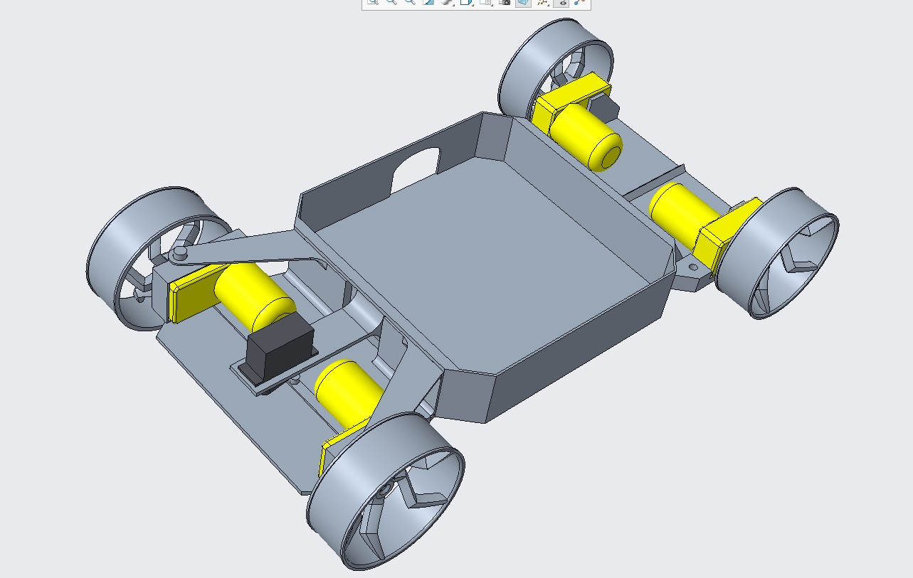

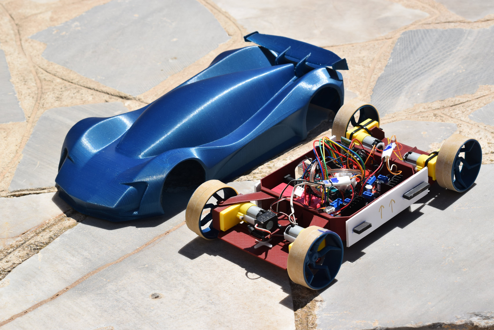

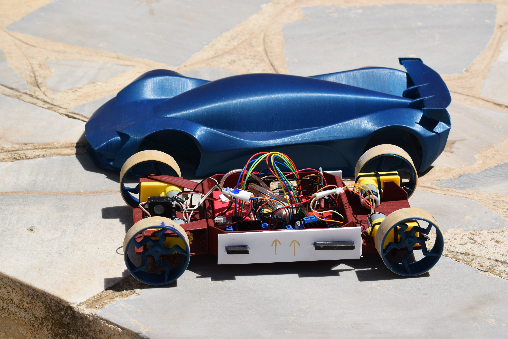

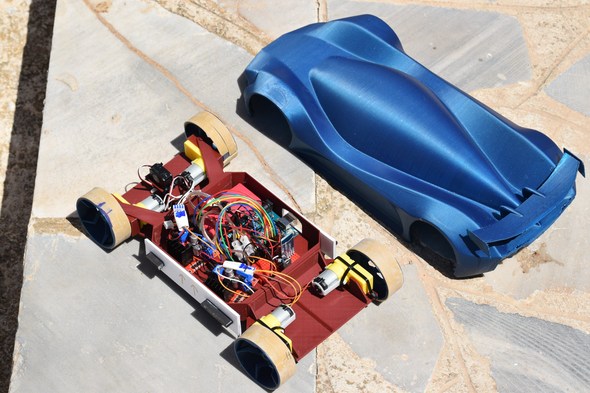

### Λίγα Λόγια για το Εξωτερικό Κέλυφος

--> Ο εσωτερικός σκελετός σχεδιάστηκε με το Blender και επίσης εκτυπώθηκε σε 3D εκτυπωτή.

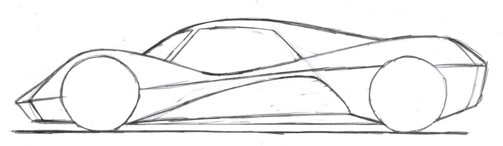

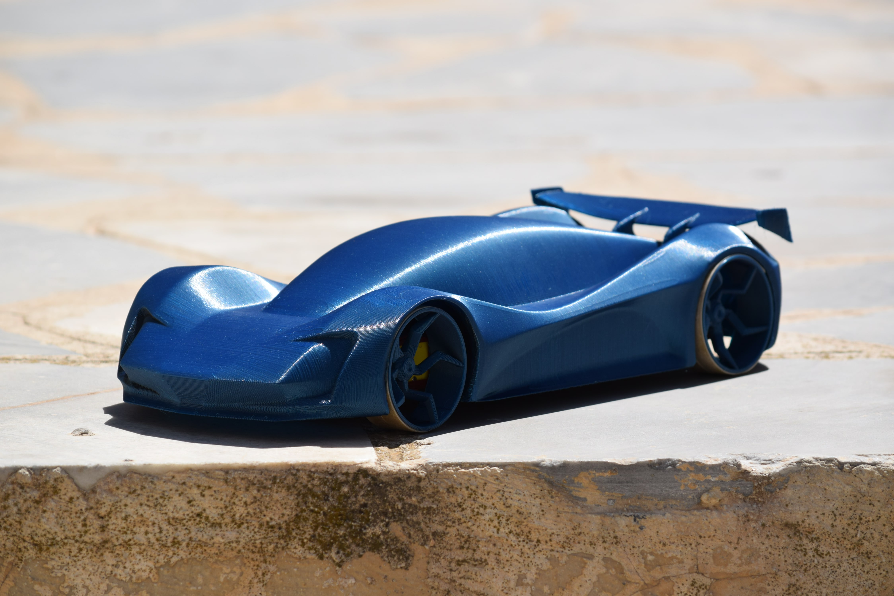

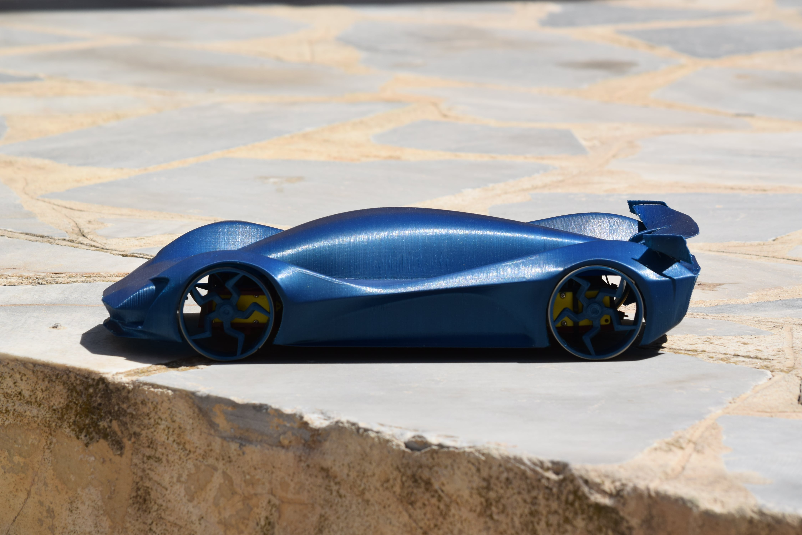

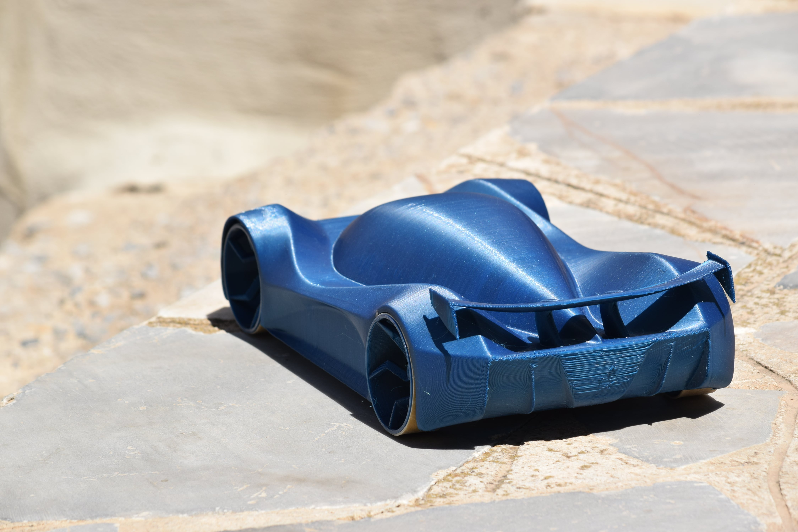

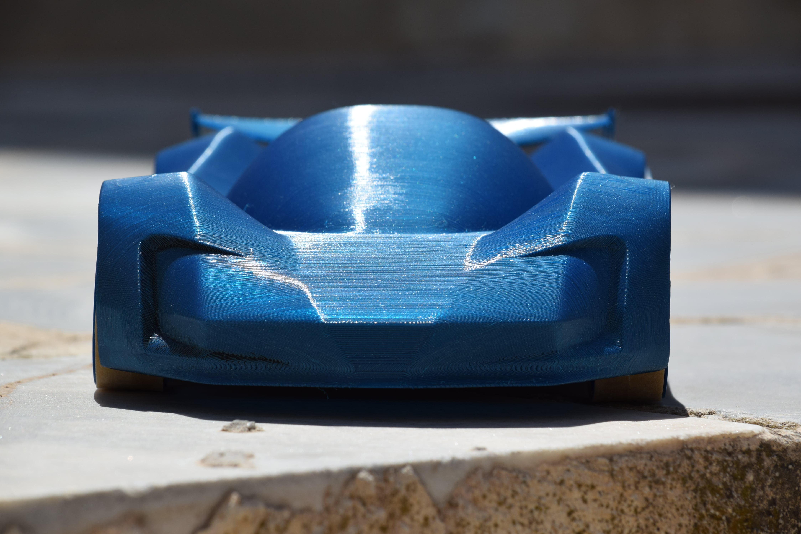

# Conclusions

# Sources
